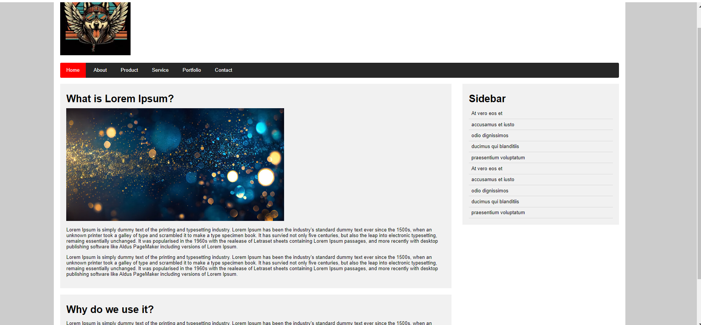

<h1 align="center">Media Query</h1>

  <h3>
    <a href="https://ande-glitch.github.io/Media-Query/">
      Link to project
    </a>
  </h3>

<!-- TABLE OF CONTENTS -->

## Table of Contents

- [Overview](#overview)
- [Built With](#built-with)
- [Features](#features)
- [How to use](#how-to-use)
- [Contact](#contact)

<!-- OVERVIEW -->
## Overview
Made by following a tutorial consisting of several properties made by intricate design utilizing media queries.

### Built With
- [HTML](https://www.w3schools.com/html/)
- [CSS](https://www.w3schools.com/css/default.asp)

## Features
- Hover
- Media Queries
- Responsive
- Images

## How To Use

- https://www.youtube.com/watch?v=WzLuTCRpvag&list=PL5e68lK9hEzciaR-CFduKDww_AVVUw66y&index=5&ab_channel=OnlineTutorials

## Contact
- GitHub [Ande-Glitch](https://github.com/Ande-glitch)
- Epost [And Nguyen](mailto:andnguyen24@outlook.com)

## Result

